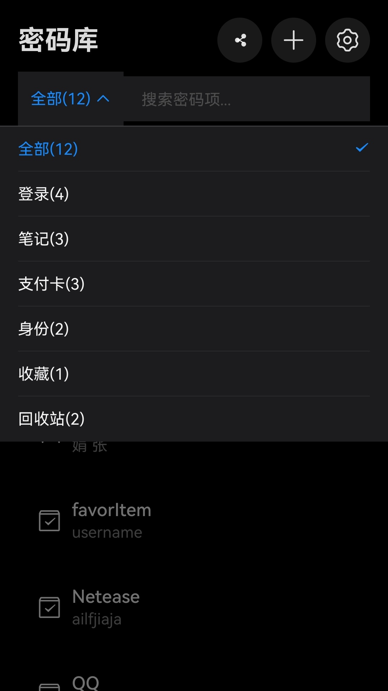
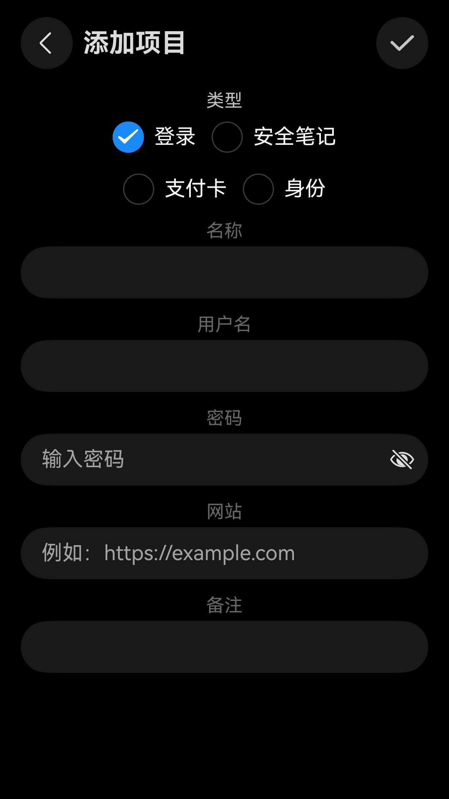
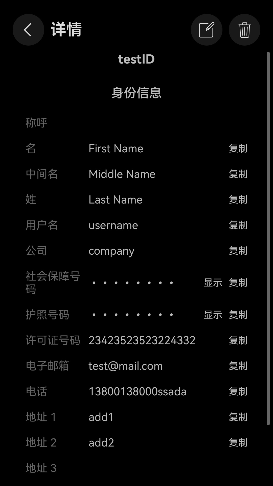
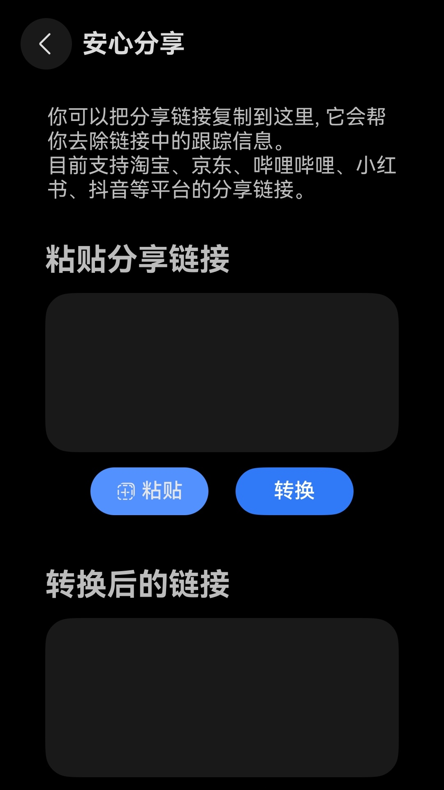

# Homowarden

Homowarden 是一款专为 HarmonyOS 打造的密码管理应用，它是跨平台开源密码管理应用 Bitwarden 的鸿蒙平台实现。它支持官方服务器及自托管服务器，采用端到端加密保障数据安全。

**注意**：本应用的密钥存储在系统关键资产区域，不会随应用卸载而清除，在卸载本应用前请务必前往设置页面注销登录。

好消息：本应用已经上架华为应用市场(AppGallery)，欢迎下载体验

## 核心功能

- **多类型密码管理** - 支持登录、支付卡、身份信息、安全笔记、TOTP验证码
- **端到端数据加解密** - 采用 AES-256 加密算法保障数据安全
- **生物识别快速解锁** - 支持指纹/面部/锁屏密码快速解锁
- **自动锁定密码库** - 应用置于后台一段时间后自动锁定密码库
- **安心分享** - 去除分享链接中的跟踪信息

## 暂不支持

密码生成器、自动填充、密码健康检查等高级功能。

## 截图

